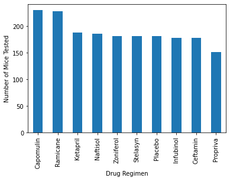
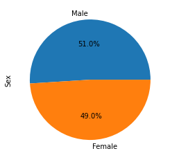
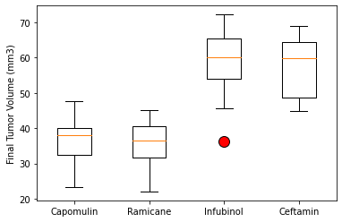
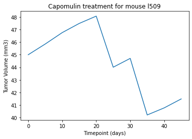
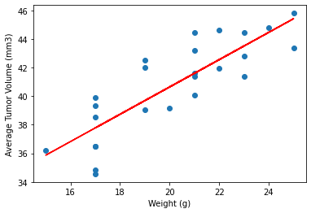

# Module 5 Challenge

## Background

You've just joined Pymaceuticals, Inc., a new pharmaceutical company that specialises in anti-cancer medications. Recently, it began screening for potential treatments for squamous cell carcinoma (SCC), a commonly occurring form of skin cancer.

As a senior data analyst at the company, you've been given access to the complete data from their most recent animal study. In this study, 249 mice who were identified with SCC tumours received treatment with a range of drug regimens. Over the course of 45 days, tumour development was observed and measured. The purpose of this study was to compare the performance of Pymaceuticals’ drug of interest, Capomulin, against the other treatment regimens.

The executive team has tasked you with generating all of the tables and figures needed for the technical report of the clinical study. They have also asked you for a top-level summary of the study results.

## Results and analysis

The instructions were carried out as instructed and the graphs below were obtained. Duplicate data was removed for Mouse g989 and the analysis performed with the remaining data. 

There are four main regimes reviewed in the analysis: Capomulin, Ramicane, Infubinol, and Ceftamin.

230 Mice under went treatment with Capomulin, 228 with Ramicane, 178 with Infubinol, and 178 with Ceftamin.

The prortion of mice tested was almost the same between genders (51% Male and 49% Female)

The Drug Regimes with the lowest Tumor Volumes over time were Capomulin and Ramicane with final mean tumor volumes of 36.667 mm3 and 36.191 mm3 respectively. The lowest performer was Infubinol with final mean tumor volumes of 57.754 mm3.

Volume decrease over time is evident in a mouse undergoing Capomulin treatment as depicted below.

It is evident that there is a strong correlation between the Average Tumor Volume and the Mice Weight. The correlation between mouse weight and the average tumor volume is 0.84

## Submission

1. Submitted and available in GitHub under https://github.com/lcardsvr/pandas-challenge

2. Written report is included in the Readme.md file 

3. Code for the submission is available under https://github.com/lcardsvr/pandas-challenge/blob/main/PyCitySchools/PyCitySchools_starter.ipynb

4. Excel verification sheet with matching numbers to the calculations obtained above is available under https://github.com/lcardsvr/pandas-challenge/blob/main/PyCitySchools/Resources/students_complete_Excel_Analysis.xlsm 

